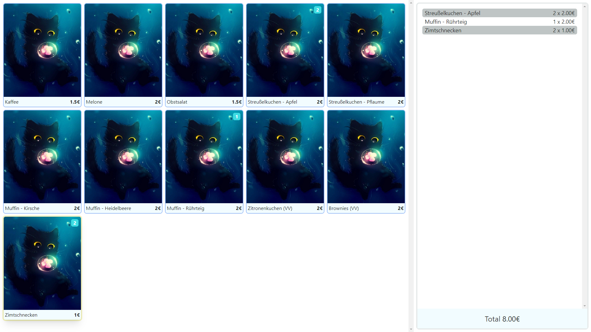
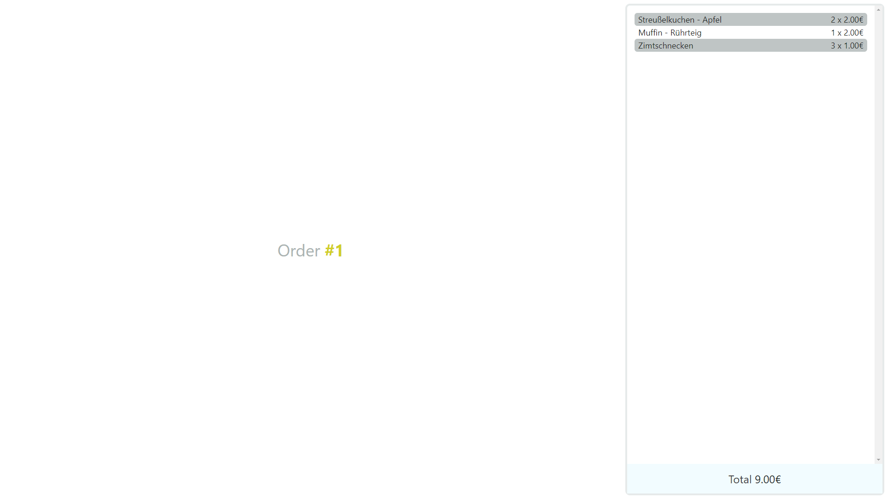
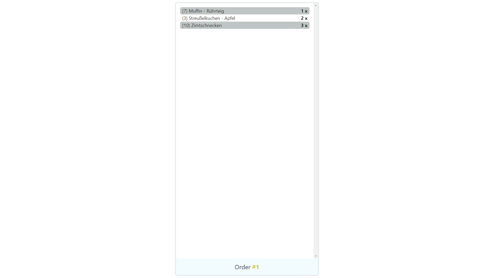

# Bubbles - The shopping system for school events
This is a shopping system desinged for school events, like selling cake on a cake bazaar.
## Principles
- Creators: are taking an order (they have customer contact)
- Fulfillers: are fulfilling the order (like getting the cake ready, poor in the coffee, ...)

=> We found this system workes really reliably, especially whith great demand
### Creators

On the right hand side you will find the items in the current order and on the lefthand side you'll find the available items. 
The navigation is as follows and requires a numblock (all keys are numpad keys):
- `8`: go up
- `6`: go right
- `2`: go down
- `4`: go left
- `/`: undo last order (will mark it as cancelled)
- `Enter`: add item to basket
- `-`: remove item from basket
- `0`: confirm/send order

After a order is confirmed the following screen will show you the order number; this is the right opportiunity to let the customer pay & to tell them the order number. After this press the confirm button again to create a new order.

### Fulfiller

As soon as an order has been confirmed it will be shown to one of the fulfillers. They now can fulfill the order by pressing `0` or undo the last fulfillment by pressing `/`. 
Once the order has been prepared, the fulfiller should tell the customer with the order number (just call the customer by him/her order id) and give them the order; then confirm it.

## Setup
As the software is in alpha the setup is a bit complex:
- Download & Extract the zip archive of the [releases](https://github.com/codecrafter404/bubbles/releases)
- Add your images (the food preview images) into the folder `app/images/`
- Start `bubble.exe`
- Navigate to `localhost:8080/config`
- Create a graphql mutation in order to add the available items with properties as follows: (see [here](https://github.com/codecrafter404/bubbles/tree/master/server/configs) for examples)
    - `id`: a unique internal id
    - `available`: wheather the item is currently available (useful if you have limeted amounts of items)
    - `identifier`: A String only shown to fulfillers, maybe useful if you have a large storage of different items
    - `name`: should be self explainatory
    - `image`: the images you previusly added are living under `/images/`; eg. `/images/0.png`
    - `isOneOff`: should be true (CustomItems are currently not implemented)
    - `price`: in €
- The clients should be in one network, therefore go to the ip of the host & <mark>set the wss and graph api hosts to match your ip addresses</mark> (under `<ip>:8080/#/`)
- From there just click on the links to get to the creation/fulfillment site & enjoy

## Build
- go into `server/` run `go build .`
- go into `bubbles-ui/` run `npm run build`
- move `server/bubble.exe` into a new dir
- copy the existing `app/` dir into the new dir
- copy the `bubbles-ui/dist/` items into the `folder/app/` & replace maybe existing files
- use the new dir to run the server

## State
- The app has already been used for a schoolevent but misses some features which i may add in the future (see Issue #5)
